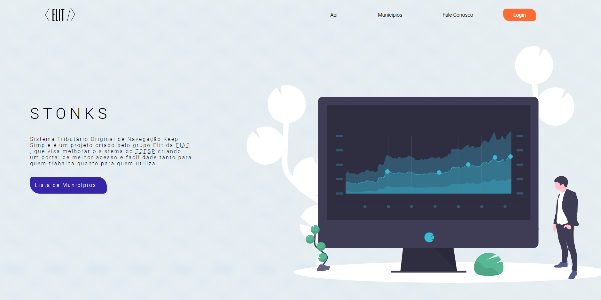

<p align="center"> 


</p>
  



# Stonks 
Sistema Tributário Original de Navegação Keep Simple é o projeto desenvolvido para o Challenge 2021 proposto pela FIAP com parceria do TCESP (tribunal de contas de são paulo).

## Índice
- ⚙ [Tecnologias utilizadas](#-tecnologias)
- 💻 [Instruções para o front end](#-instruções-para-o-front-end)
- 💻 [Instruções para o back end](#-instruções-para-o-back-end)

---

## ⚙ Tecnologias
  - **Back end**
    - [Spring Boot](https://spring.io/)
    - [MySQL](https://www.mysql.com/)
    - [JWT token](https://jwt.io/)
    - [Heroku](https://www.heroku.com/)
    - 
  - **Front end**
    - [React](https://reactjs.org/)
    - [Typescript](https://www.typescriptlang.org/)
    - [Axios](https://github.com/axios/axios)
    - [Yup](https://www.npmjs.com/package/yup)
    - [Date-fns](https://date-fns.org/)
    - 
  - **Outras tecnologias**
    - [Docker](https://www.docker.com/)
    - [Firebase](https://firebase.google.com/)
---

## 💻 Instruções para o [front end](https://github.com/STONKS-ia/stonks-ui)

  Após executar o passo anterior e garantir que o back end está rodando, você poderá inicializar o front end:

  ```bash
    # Baixar as dependências
    npm install

    # Inicializar a aplicação
    npm start
  ```
    use o arquivo **.env.example** como base para colocar suas credenciais do firebase.
---

## 💻 Instruções para o [back end](https://github.com/STONKS-ia/Stonks-core)

  Começaremos criando as instâncias dos nossos bancos de dados. Para esse projeto, o **docker** foi utilizado. Abaixo, seguem os comandos para criar os containers e inicializar as instâncias:

  ```bash
    # Criando container com instância do MySQL
        docker run -d -p 3306:3306 --name StonksDB -e MYSQL_ROOT_PASSWORD=@R0ot3@ mysql:8.0

    # Inicializando as instâncias
        docker start StonksDB
  ```
  
  ```bash
    # Instalar todas as dependências do projeto
        mvn install
  ```

---


